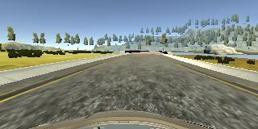
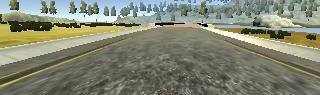
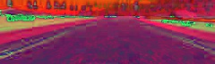

## Behavioral Cloning Project

This project requires the training of a convnet through Keras.  Images are produced in a vehicle simulator and trained to produce a steering angle based on forward-facing video input.

### Usage:

The script for creating the model is `model.py`

```
usage: model.py [-h] [-tune] [-flip] [-side]

CNN Architecture for Udacity Simulator image dataset

optional arguments:
  -h, --help  show this help message and exit
  -tune       Start in fine-tune mode
  -flip       Flip center data
  -side       Use left and right side images
```

Example: `python model.py -flip -side`

The script for running the server is `drive.py`

```
usage: drive.py [-h] model

Remote Driving

positional arguments:
  model       Path to model definition json. Model weights should be on the
              same path.

optional arguments:
  -h, --help  show this help message and exit
```

Example: `python drive.py model.json`

### Description

The car is tested on track one.  The car starts in autonomous mode on a relative straightaway.  The first left turn (Turn 1) leads to a bridge and then another left turn (Turn 2).  Next is a small straightaway followed by a right turn (Turn 3).  The last and final left turn (Turn 4) completes the lap.  

The students are issued a data set of 24108 images to train the network.  I augmented that with several more batches of images of 32895 and 6288 images.  The first batch of images include driving around the track smoothly with a controller.  I modified the throttle input to be the right analog stick to get an almost constant 20 MPH around the track.  The second batch of images are all "recovery" images of Turn 1, Turn 2 and Turn 3.

#### Data Capture

The simulator captures three images per cycle -- one left, one center and one right.  Along with these images are a steering angle, throttle, brake and speed.  The data is indexed in a csv file `driving_log.csv`

The csv file is parsed and the images are loaded and preprocessed.

#### Image Preprocessing
 
In pre-processing the images, I started with the raw image (320x160):



Next I cropped off the sky and the hood of the car (320x95):



Finally, I downsized the image 25% and converted from RGB to HSV (240x72):



I tried regular RGB, BGR, HLS and HSV.  I went with HSV because it seemed to create the greatest contrast of the road to the land, water and sky.

I gathered all the processed images in-memory.  The MacBook and AWS instance I used with this project have many GB of RAM, but the AWS instance only has 4GB of video memory.  For this reason, I used a python generator to process batches of 92 images at a time.

I added flags in the argument parser for flip and side.  The flip flag will use the center image and angle and flip it with the reverse angle.  The side flag is used to process the side images (or not).  The last tuning I did was to not include any images that had a 0.0 steering angle.  The total number of images in memory was 43236 with a size of 2.24 GB.

If using the left and right side images, the corresponding steering angle is adjusted to avoid under-steering.  This offset was difficult to test, but I tried 0.1, 0.15, 0.2 and 0.25 and found that 0.2 gave the best adjusted steering angle.  This offset was **added** to the left image angle and **subtracted** from the right image angle.
  
#### Modeling

I broke the set of images and angles up into training and validation, with 1% going toward the validation set.  For the above images, that was 38912 training and 4324 validation.

For my neural net, I started using the "VGG-like convnet" described [here](https://keras.io/getting-started/sequential-model-guide/) but could never get past Turn 3.  Then I looked around online at the NVIDIA documentation to see how they created models.  In the end, I went with this model:
```
____________________________________________________________________________________________________
Layer (type)                     Output Shape          Param #     Connected to
====================================================================================================
lambda_1 (Lambda)                (None, 72, 240, 3)    0           lambda_input_1[0][0]
____________________________________________________________________________________________________
convolution2d_1 (Convolution2D)  (None, 70, 238, 64)   1792        lambda_1[0][0]
____________________________________________________________________________________________________
activation_1 (Activation)        (None, 70, 238, 64)   0           convolution2d_1[0][0]
____________________________________________________________________________________________________
dropout_1 (Dropout)              (None, 70, 238, 64)   0           activation_1[0][0]
____________________________________________________________________________________________________
convolution2d_2 (Convolution2D)  (None, 68, 236, 32)   18464       dropout_1[0][0]
____________________________________________________________________________________________________
activation_2 (Activation)        (None, 68, 236, 32)   0           convolution2d_2[0][0]
____________________________________________________________________________________________________
convolution2d_3 (Convolution2D)  (None, 66, 234, 16)   4624        activation_2[0][0]
____________________________________________________________________________________________________
activation_3 (Activation)        (None, 66, 234, 16)   0           convolution2d_3[0][0]
____________________________________________________________________________________________________
convolution2d_4 (Convolution2D)  (None, 64, 232, 8)    1160        activation_3[0][0]
____________________________________________________________________________________________________
activation_4 (Activation)        (None, 64, 232, 8)    0           convolution2d_4[0][0]
____________________________________________________________________________________________________
maxpooling2d_1 (MaxPooling2D)    (None, 32, 116, 8)    0           activation_4[0][0]
____________________________________________________________________________________________________
flatten_1 (Flatten)              (None, 29696)         0           maxpooling2d_1[0][0]
____________________________________________________________________________________________________
dropout_2 (Dropout)              (None, 29696)         0           flatten_1[0][0]
____________________________________________________________________________________________________
dense_1 (Dense)                  (None, 128)           3801216     dropout_2[0][0]
____________________________________________________________________________________________________
activation_5 (Activation)        (None, 128)           0           dense_1[0][0]
____________________________________________________________________________________________________
dropout_3 (Dropout)              (None, 128)           0           activation_5[0][0]
____________________________________________________________________________________________________
dense_2 (Dense)                  (None, 64)            8256        dropout_3[0][0]
____________________________________________________________________________________________________
activation_6 (Activation)        (None, 64)            0           dense_2[0][0]
____________________________________________________________________________________________________
dense_3 (Dense)                  (None, 32)            2080        activation_6[0][0]
____________________________________________________________________________________________________
activation_7 (Activation)        (None, 32)            0           dense_3[0][0]
____________________________________________________________________________________________________
dense_4 (Dense)                  (None, 1)             33          activation_7[0][0]
====================================================================================================
Total params: 3,837,625
Trainable params: 3,837,625
Non-trainable params: 0
```

The largest increase in connections occurred while tuning the last three fully-connected layers and the shape of the image.

The last argument was for fine-tuning (which I did not utilize).  If present, the script will look for the model file and load it while running the fit generator at a lower learning rate.

The hyper-parameters used were:

* Optimizer: Adam
* Learing rate: 1e-4 (1e-6 in fine-tune mode)
* Epochs: 10
* Batch size: 92
* Loss: Mean Squared Error

### Solution

The training data for the successful model was the following:
```
Epoch 1/10
38976/38976 [==============================] - 420s - loss: 0.0297 - val_loss: 0.0251
Epoch 2/10
38976/38976 [==============================] - 414s - loss: 0.0233 - val_loss: 0.0230
Epoch 3/10
38976/38976 [==============================] - 414s - loss: 0.0217 - val_loss: 0.0224
Epoch 4/10
38976/38976 [==============================] - 414s - loss: 0.0204 - val_loss: 0.0209
Epoch 5/10
38976/38976 [==============================] - 414s - loss: 0.0195 - val_loss: 0.0212
Epoch 6/10
38976/38976 [==============================] - 414s - loss: 0.0187 - val_loss: 0.0196
Epoch 7/10
38976/38976 [==============================] - 414s - loss: 0.0180 - val_loss: 0.0201
Epoch 8/10
38976/38976 [==============================] - 414s - loss: 0.0172 - val_loss: 0.0178
Epoch 9/10
38976/38976 [==============================] - 414s - loss: 0.0166 - val_loss: 0.0179
Epoch 10/10
38976/38976 [==============================] - 414s - loss: 0.0158 - val_loss: 0.0168
Test Loss=0.014383851071951824
```

The `Test Loss` value uses the `evaluate_generator` method against *all* the images.  Since I did not separate the images into a third test set, this `Test Loss` value is not useful.

Along with the modeled steering angle, I return a throttle variable based on the steepness of the angle.  For angles less than 0.05, I set the throttle to 0.175.  This results in speeds around 20 MPH.  For angles greater than 0.05, I set the throttle to 0.125.  This results in speeds around 15 MPH.  My successful steering model cannot handle throttle values above 0.2. 

The most frustrating part of this project was that for almost two weeks, I was changing models, tuning parameters and adjusting offsets all while mistakenly coding the left image as the center.  This bug caused so much delay!  But I was finally able to get it to navigate Track 1.  It does not navigate Track 2 successfully:


### Reflections

There are several changes I would make to get the model to navigate Track 1 with less jerky movements:

* Introduce *some* zero angle images (like maybe 10%)
* Use some type of smoothing mechanism to average the last angle(s) with the current
* Use image augmentation to brighten or darken images to train for Track 2
* Create an entirely separate model for throttle values that predicts when to brake before turns and accelerate out of them